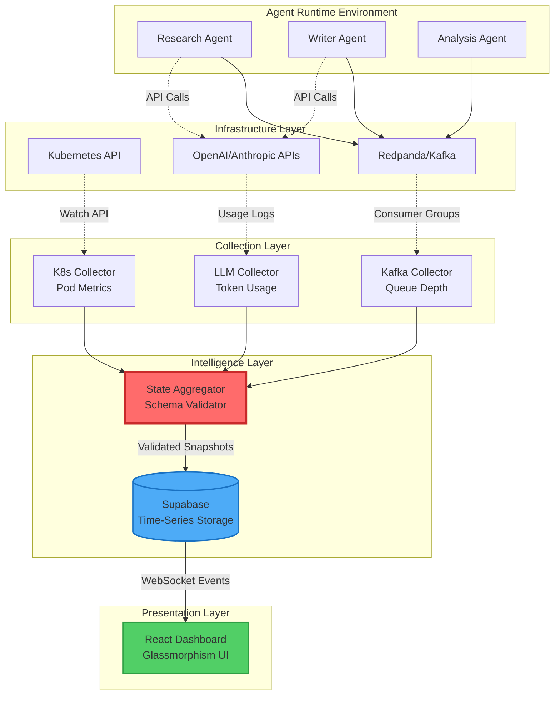

# Oracle Monitor 🔮

**A Real-Time Observability Platform for Multi-Agent AI Systems**

[](https://opensource.org/licenses/MIT)
[](https://www.python.org/downloads/)
[](https://kubernetes.io/)
[](https://reactjs.org/)
[](https://fastapi.tiangolo.com/)

---

## 🎯 What is Oracle Monitor?

Imagine debugging a distributed system where multiple AI agents are orchestrating complex workflows across Kubernetes pods, message queues, and third-party APIs. Traditional monitoring tools show you *what* happened. Oracle Monitor shows you *everything* — in real time.

**Oracle Monitor** is a comprehensive observability platform built specifically for multi-agent AI systems. It provides:

- **Unified State Snapshots**: See your entire system's state at any moment — from Kubernetes pod health to agent reasoning chains to LLM token consumption
- **Real-Time Intelligence**: WebSocket-powered dashboard updates the instant something changes anywhere in your infrastructure
- **Historical Time Travel**: Navigate through past system states to debug issues that happened hours or days ago
- **Agent Introspection**: Peek inside agent "thoughts" as they reason through tasks and make decisions
- **Cost Intelligence**: Track every API call, token, and dollar spent across your LLM providers

This isn't just monitoring. It's omniscience for your AI infrastructure.

---

## 🌟 Why Oracle Monitor Exists

During my work on autonomous agent systems at RVCE, I kept running into the same frustrating problem: **distributed debugging is impossible without comprehensive context**.

When an agent fails, the failure often cascades from a chain of events:
1. A Kafka message gets delayed by 200ms
2. An agent times out waiting for that message
3. It retries, hitting an OpenAI rate limit
4. The pod gets OOMKilled because it leaked memory during retry logic
5. Kubernetes reschedules it, but the task is now orphaned

Traditional tools would show me each piece in isolation. Prometheus would show the OOMKill. Kafka UI would show the message delay. OpenAI's dashboard would show the rate limit. But connecting these dots required mental gymnastics and hours of log archaeology.

**Oracle Monitor solves this by aggregating everything into a single, time-stamped snapshot.** Now when something goes wrong, I can rewind to that exact moment and see the complete picture — every agent's state, every queue depth, every API call in flight, every pod restart — all in one unified view.

---

## 🏗️ System Architecture

The platform is designed around three core principles:

1. **Non-Invasive Observation**: Collectors watch your system without interfering with it
2. **Centralized Aggregation**: All telemetry flows through a single aggregation point
3. **Real-Time Synchronization**: State changes propagate to the UI instantly via Supabase Realtime

### High-Level Data Flow



### Component Breakdown

#### 🤖 **Autonomous Agents** (`/agents`)

The actual workers in your system. These Python microservices execute tasks, make decisions, and interact with external APIs.

**Current Implementations:**
- **Research Agent**: Web scraping and information gathering using Playwright
- **Writer Agent**: Content synthesis and report generation using GPT-4
- **Analysis Agent**: Data processing and pattern recognition

**Telemetry Emissions:**
```python
# Agents emit structured events to Kafka
{
    "agent_id": "research-agent-7f8d9",
    "timestamp": "2024-02-06T14:32:11.482Z",
    "event_type": "task_started",
    "task_id": "research-tech-trends-2024",
    "internal_state": {
        "reasoning": "Breaking down query into 3 sub-searches",
        "tools_planned": ["web_search", "scrape_page", "summarize"]
    }
}
```

#### 📡 **Collectors** (`/collectors`)

Specialized observers that monitor different layers of the infrastructure without interfering with operations.

**K8s Collector** (`k8s_collector/`)
- Watches pod lifecycle events (Created, Running, Failed, OOMKilled)
- Scrapes resource usage metrics (CPU, memory, network I/O)
- Tracks replica counts and health checks
- Detects restart loops and crashback patterns

**Kafka Collector** (`kafka_collector/`)
- Monitors consumer lag across all topic partitions
- Calculates end-to-end message latency
- Identifies dead letter queue buildups
- Tracks throughput and backpressure indicators

**LLM Collector** (`llm_collector/`)
- Intercepts API requests/responses via proxy middleware
- Aggregates token consumption (prompt + completion)
- Calculates cost per request using current pricing
- Detects rate limit hits and quota exhaustion

#### ⚡ **State Aggregator** (`/aggregator`)

The brain of Oracle Monitor. This service:

1. **Consumes** telemetry streams from all collectors
2. **Merges** partial states into a unified snapshot
3. **Validates** against `oracle_state.schema.json` to ensure data integrity
4. **Persists** snapshots to Supabase every 2 seconds
5. **Triggers** real-time updates to connected dashboards

**Aggregation Logic:**
```python
# Pseudo-code for aggregation cycle
while True:
    snapshot = {
        "timestamp": now(),
        "kubernetes": k8s_collector.get_state(),
        "kafka": kafka_collector.get_state(),
        "llm_usage": llm_collector.get_state(),
        "agents": [
            research_agent.get_state(),
            writer_agent.get_state(),
        ]
    }
    
    # Validate against JSON Schema
    validate(snapshot, oracle_state_schema)
    
    # Persist to time-series database
    supabase.table("system_snapshots").insert(snapshot)
    
    sleep(2)
```

#### 💾 **Supabase Backend**

Acts as both the persistence layer and real-time event bus.

**Database Schema:**
```sql
-- Main snapshots table
CREATE TABLE system_snapshots (
    id UUID PRIMARY KEY DEFAULT uuid_generate_v4(),
    timestamp TIMESTAMPTZ NOT NULL,
    snapshot JSONB NOT NULL,
    
    -- Indexed for fast time-range queries
    CONSTRAINT snapshots_timestamp_idx UNIQUE (timestamp)
);

-- Enable real-time subscriptions
ALTER TABLE system_snapshots REPLICA IDENTITY FULL;
```

**Why Supabase?**
- Built-in WebSocket support (no need for custom Socket.io server)
- JSONB column type with fast indexing for complex queries
- Row-level security for multi-tenant deployments
- Generous free tier for development

#### 🎨 **Glassmorphism Dashboard** (`/frontend`)

A modern React application inspired by Apple's design language. The UI is built using:

- **Vite**: Lightning-fast HMR during development
- **TailwindCSS**: Utility-first styling with custom glassmorphism components
- **Recharts**: Composable charting library for time-series visualizations
- **Supabase-JS**: Real-time subscriptions to snapshot updates

**Key Features:**
- **Agent Grid**: Live cards showing each agent's current task and reasoning
- **Infrastructure Health**: CPU/Memory gauges for each Kubernetes pod
- **Message Flow**: Real-time Kafka topic throughput graphs
- **Cost Tracker**: Running total of LLM API spend with per-agent breakdown
- **Alert Ticker**: Scrolling banner for system anomalies (rate limits, OOMKills, etc.)

---

## 📂 Repository Structure

```
oracle-monitor/
│
├── 🤖 agents/                      # Agent implementations
│   ├── base/
│   │   ├── agent.py               # Abstract BaseAgent class
│   │   ├── kafka_client.py        # Kafka producer wrapper
│   │   └── telemetry.py           # Structured logging utilities
│   │
│   ├── research_agent/
│   │   ├── agent.py               # Research-specific logic
│   │   ├── tools/                 # Web scraping, search tools
│   │   └── Dockerfile
│   │
│   └── writer_agent/
│       ├── agent.py               # Writing-specific logic
│       ├── templates/             # Report templates
│       └── Dockerfile
│
├── 🔌 api/                         # FastAPI backend
│   ├── main.py                    # API routes and startup
│   ├── models.py                  # Pydantic schemas
│   └── config.py                  # Environment configuration
│
├── 📡 collectors/                  # Monitoring services
│   ├── k8s_collector/
│   │   ├── collector.py           # Pod watcher implementation
│   │   ├── metrics.py             # Resource usage calculations
│   │   └── Dockerfile
│   │
│   ├── kafka_collector/
│   │   ├── collector.py           # Consumer lag monitoring
│   │   └── Dockerfile
│   │
│   └── llm_collector/
│       ├── collector.py           # API call interceptor
│       ├── pricing.py             # Token cost calculations
│       └── Dockerfile
│
├── ⚡ aggregator/                  # State aggregation service
│   ├── aggregator.py              # Main aggregation loop
│   ├── validator.py               # JSON Schema validation
│   └── Dockerfile
│
├── 🎨 frontend/                    # React dashboard
│   ├── public/
│   ├── src/
│   │   ├── components/
│   │   │   ├── AgentCard.jsx      # Individual agent status
│   │   │   ├── InfrastructureGrid.jsx
│   │   │   ├── CostTracker.jsx
│   │   │   └── AlertTicker.jsx
│   │   │
│   │   ├── services/
│   │   │   └── supabase.js        # Real-time subscriptions
│   │   │
│   │   ├── App.jsx
│   │   └── main.jsx
│   │
│   ├── package.json
│   └── vite.config.js
│
├── 🏗️ infrastructure/              # Deployment configs
│   ├── kubernetes/
│   │   ├── secrets/
│   │   │   └── api-keys-secret.yaml
│   │   │
│   │   ├── deployments/
│   │   │   ├── research-agent.yaml
│   │   │   ├── writer-agent.yaml
│   │   │   ├── kafka-collector.yaml
│   │   │   └── aggregator.yaml
│   │   │
│   │   └── services/
│   │       └── kafka-service.yaml
│   │
│   └── kafka/
│       └── redpanda-config.yaml   # Message broker setup
│
├── 📜 schema/                      # Data contracts
│   └── oracle_state.schema.json   # System snapshot schema
│
├── 📖 docs/                        # Documentation
│   ├── ARCHITECTURE.md
│   ├── API_REFERENCE.md
│   └── TROUBLESHOOTING.md
│
├── RUN_INSTRUCTIONS.md             # Step-by-step setup guide
├── requirements.txt                # Python dependencies
└── README.md                       # You are here
```

---

## 🚀 Getting Started

### Prerequisites

Before you begin, ensure you have the following installed:

- **Docker Desktop** (v20.10+) with Kubernetes enabled
- **Minikube** (v1.25+) for local Kubernetes cluster
- **Python 3.11+** with pip
- **Node.js 18+** with npm or yarn
- **kubectl** CLI tool
- **Supabase Account** (free tier works perfectly)

### Step 1: Clone and Setup

```bash
# Clone the repository
git clone https://github.com/pranavjambur/oracle-monitor.git
cd oracle-monitor

# Install Python dependencies
pip install -r requirements.txt

# Install frontend dependencies
cd frontend
npm install
cd ..
```

### Step 2: Configure Supabase

1. Create a new project at [supabase.com](https://supabase.com)
2. Run the schema migration:
   ```sql
   -- In Supabase SQL Editor
   CREATE TABLE system_snapshots (
       id UUID PRIMARY KEY DEFAULT uuid_generate_v4(),
       timestamp TIMESTAMPTZ NOT NULL,
       snapshot JSONB NOT NULL
   );
   
   CREATE INDEX idx_snapshots_timestamp ON system_snapshots(timestamp DESC);
   ```

3. Create a `.env` file in the project root:
   ```env
   SUPABASE_URL=https://your-project.supabase.co
   SUPABASE_ANON_KEY=your-anon-key
   OPENAI_API_KEY=sk-...
   ANTHROPIC_API_KEY=sk-ant-...
   ```

### Step 3: Start Local Kubernetes

```bash
# Start Minikube cluster
minikube start --driver=docker --cpus=4 --memory=8192

# Verify cluster is running
kubectl cluster-info

# Create namespace
kubectl create namespace oracle-monitor
kubectl config set-context --current --namespace=oracle-monitor
```

### Step 4: Deploy Infrastructure

```bash
# Build agent Docker images
minikube image build -t oracle-research-agent:latest -f agents/research_agent/Dockerfile .
minikube image build -t oracle-writer-agent:latest -f agents/writer_agent/Dockerfile .

# Create Kubernetes secrets for API keys
kubectl create secret generic api-keys \
  --from-literal=openai-key=$OPENAI_API_KEY \
  --from-literal=anthropic-key=$ANTHROPIC_API_KEY \
  --from-literal=supabase-url=$SUPABASE_URL \
  --from-literal=supabase-key=$SUPABASE_ANON_KEY

# Deploy Kafka/Redpanda
kubectl apply -f infrastructure/kafka/redpanda-config.yaml

# Deploy collectors and aggregator
kubectl apply -f infrastructure/kubernetes/deployments/

# Wait for pods to be ready
kubectl wait --for=condition=ready pod --all --timeout=300s
```

### Step 5: Launch Dashboard

```bash
cd frontend
npm run dev
```

Open your browser to `http://localhost:5173` and you should see the Oracle Monitor dashboard come to life!

---

## 💡 Usage Examples

### Scenario 1: Debugging a Failed Research Task

A research agent crashed while processing a task. Here's how Oracle Monitor helps you debug:

1. **Navigate to the Timeline**: Scrub backward to the crash timestamp
2. **Check Agent State**: See the agent was mid-reasoning: `"Awaiting web_search tool response"`
3. **Review Kafka Metrics**: Notice a 5-second lag spike in the `tool-responses` topic
4. **Inspect LLM Logs**: See a 429 rate limit error from OpenAI API
5. **Connect the Dots**: The tool response was delayed, agent timed out and retried, hitting rate limit

**Root Cause**: Insufficient consumer parallelism on the tool-responses topic.

**Fix**: Increase Kafka partition count and consumer replicas.

### Scenario 2: Optimizing Token Costs

You notice your LLM costs doubled this week. Oracle Monitor reveals:

1. **Cost Tracker Shows**: Writer Agent is consuming 3x more tokens than last week
2. **Agent Introspection**: Recent tasks show overly verbose reasoning chains
3. **Prompt Analysis**: System prompt was updated to include more examples

**Action**: Reduced example count in system prompt, tokens per task dropped by 60%.

---

## 🔧 Advanced Configuration

### Adjusting Snapshot Frequency

Edit `aggregator/aggregator.py`:

```python
SNAPSHOT_INTERVAL_SECONDS = 2  # Change to 5 for less granular data
```

### Enabling Additional LLM Providers

Add to `llm_collector/pricing.py`:

```python
PRICING = {
    "openai": {"gpt-4": {"input": 0.03, "output": 0.06}},
    "anthropic": {"claude-3-opus": {"input": 0.015, "output": 0.075}},
    "cohere": {"command": {"input": 0.001, "output": 0.002}}  # Add new
}
```

### Custom Agent Implementation

Create a new agent by extending `BaseAgent`:

```python
from agents.base.agent import BaseAgent

class MyCustomAgent(BaseAgent):
    def process_task(self, task: dict):
        self.emit_telemetry("task_started", {
            "reasoning": "Analyzing customer sentiment",
            "tools_planned": ["sentiment_analysis", "report_generator"]
        })
        
        # Your custom logic here
        result = self.analyze_sentiment(task["data"])
        
        self.emit_telemetry("task_completed", {
            "result_summary": result
        })
```

---

## 🤝 Contributing

Contributions are welcome! Here's how you can help:

### Reporting Bugs

Found a bug? Please open an issue with:
- Steps to reproduce
- Expected vs actual behavior
- Relevant logs from `kubectl logs <pod-name>`

### Feature Requests

Have an idea? Open an issue tagged `enhancement` and describe:
- The use case it solves
- How it fits into the current architecture
- Any implementation ideas

### Pull Requests

1. Fork the repo
2. Create a feature branch (`git checkout -b feature/amazing-feature`)
3. Make your changes
4. Add tests if applicable
5. Commit with clear messages (`git commit -m 'Add sentiment analysis agent'`)
6. Push to your fork (`git push origin feature/amazing-feature`)
7. Open a Pull Request

---

## 📊 Performance Benchmarks

Tested on a MacBook Pro (M1, 16GB RAM) with Minikube:

| Metric | Value |
|--------|-------|
| **Snapshot Latency** | ~150ms (collection to UI render) |
| **Dashboard FPS** | 60fps with 10 active agents |
| **Memory Footprint** | ~2GB total (all services) |
| **Supabase Writes/min** | 30 (at 2-second snapshot interval) |
| **Historical Query Speed** | <100ms for 24-hour range |

---

## 🛠️ Troubleshooting

### Pods Keep Restarting

```bash
# Check pod logs
kubectl logs <pod-name> --previous

# Common issue: Missing API keys
kubectl get secret api-keys -o yaml
```

### Dashboard Not Updating

1. Verify Supabase Realtime is enabled (Project Settings → API → Realtime)
2. Check browser console for WebSocket errors
3. Confirm aggregator is writing snapshots:
   ```bash
   kubectl logs deployment/aggregator
   ```

### High Kafka Lag

```bash
# Check consumer group status
kubectl exec -it kafka-0 -- kafka-consumer-groups.sh \
  --bootstrap-server localhost:9092 \
  --describe --group oracle-collectors
```

For more help, see **[TROUBLESHOOTING.md](./docs/TROUBLESHOOTING.md)**.

---

## 📄 License

This project is licensed under the MIT License - see the [LICENSE](LICENSE) file for details.

---

## 🙏 Acknowledgments

This project was built as part of my work at **R. V. College of Engineering, Bangalore**. Special thanks to:

- My mentors for guidance on distributed systems architecture
- The open-source community for incredible tools like Kubernetes, React, and FastAPI
- Supabase for making real-time databases accessible to everyone

---

## 📬 Contact

**Pranav V Jambur**  
Computer Science & Engineering  
R. V. College of Engineering, Bangalore

📧 pranavvjambur.cs23@rvce.edu.in  
🔗 [GitHub](https://github.com/pranavjambur) | [LinkedIn](https://linkedin.com/in/pranavjambur)

---

<div align="center">

**Built with using Python, FastAPI, React, Kubernetes, and Supabase**

*If this project helped you, consider giving it a !*

</div>