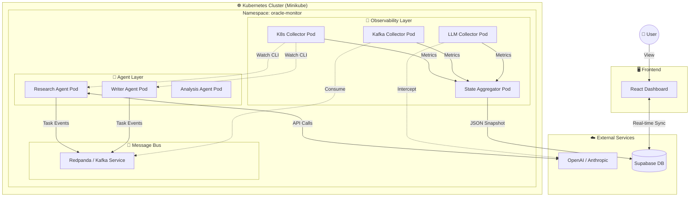

# 🔮 Oracle Monitor

   

**Oracle Monitor** is a unified observability platform designed for **Multi-Agent Systems**. It aggregates state from Kubernetes, distributed message queues, LLM providers, and autonomous agents into a single, comprehensive **"God Mode"** snapshot.

By consolidating telemetry from across the stack, it allows developers and AI agents to debug complex interactions, visualize system health, and time-travel through system states.

---

## 🏗️ System Architecture

The following diagram illustrates the complete infrastructure topology, showing how **Pods** inside the **Kubernetes Cluster** interact with external services and the message bus.



---

## 🧩 Components

### 1. **🧠 Autonomous Agents**
Python-based microservices that perform actual work.
*   **Research Agent**: Browses the web to gather information.
*   **Writer Agent**: Synthesizes information into reports.
*   *Telemetry*: They report internal thoughts, tool usage, and task status to Kafka.

### 2. **📡 Collectors**
Specialized services that "watch" the system without interfering.
*   **K8s Collector**: Monitors Pod health, restarts, and resource usage (CPU/RAM).
*   **Kafka Collector**: Observes queue depth, message latency, and dead letter queues.
*   **LLM Collector**: Tracks token consumption, costs, and rate limits.

### 3. **⚡ Aggregator**
The core engine. It combines partial states from all collectors into a unified `SystemSnapshot`. It handles detailed JSON schema validation to ensure data consistency.

### 4. **💾 Supabase (Persistence)**
Acts as the "Black Box" recorder.
*   **`system_snapshots`**: Stores the full state of the universe every few seconds.
*   **Real-time Engine**: Pushes updates to the UI instantly.

### 5. **🖥️ Glassmorphism Dashboard**
A modern React UI that visualizes the "God Mode" snapshot.
*   **Live Charts**: Token usage and queuing latency.
*   **Agent Grid**: Real-time status of what every agent is thinking.
*   **Alert Ticker**: Instant notifications of system anomalies.

---

## 📂 Project Structure

```text
oracle-monitor/
├── 🤖 agents/                 # Autonomous agent implementations
│   ├── base/               # Abstract base agent class (SDK)
│   ├── research_agent/     # Web research specialist
│   └── writer_agent/       # Content generation specialist
├── 🔌 api/                    # FastAPI backend service
├── 📡 collectors/             # Data ingestion services
│   ├── k8s_collector/      # Kubernetes metrics
│   └── kafka_collector/    # Message bus monitoring
├── 🎨 frontend/               # React + Vite Dashboard
│   ├── src/features/       # Feature-based UI components (Agents, Infra)
│   └── src/services/       # Supabase API integration
├── 🏗️ infrastructure/         # Deployment configurations
│   ├── kubernetes/         # K8s YAML manifests
│   └── kafka/              # Redpanda/Kafka setup
└── 📜 schema/                 # JSON Schemas for strict type validation
```

---

## 🚀 How It Works

1.  **Ingestion**: Agents execute tasks and emit logs. Collectors watch the infrastructure.
2.  **Aggregation**: The **Aggregator** service reads these streams and builds a JSON object conforming to `oracle_state.schema.json`.
3.  **Broadcast**: The snapshot is saved to Supabase.
4.  **visualization**: The Dashboard receives the `INSERT` event via WebSocket and updates the UI.

---

## 🏁 Getting Started

### Prerequisites
*   **Docker Desktop** (for Minikube)
*   **Python 3.11+**
*   **Node.js & npm**
*   **Supabase Account**

### ⚡ Quick Run Guide

For the complete, step-by-step tutorial, see **[👉 RUN_INSTRUCTIONS.md](./RUN_INSTRUCTIONS.md)**.

**1. Infrastructure**
```powershell
minikube start --driver=docker
minikube kubectl -- apply -f infrastructure/kubernetes/secrets/api-keys-secret.yaml
```

**2. Deploy System**
```powershell
minikube image build -t oracle-monitor-agent:latest -f agents/Dockerfile.agent .
minikube kubectl -- apply -f infrastructure/kubernetes/deployments/
```

**3. Start Dashboard**
```powershell
cd frontend
npm install
npm run dev
```

---
*Built with using Python, FastAPI, React, Kubernetes, and Supabase.*

<br />

---

### **Pranav V Jambur**
**R. V. College of Engineering**
pranavvjambur.cs23@rvce.edu.in
